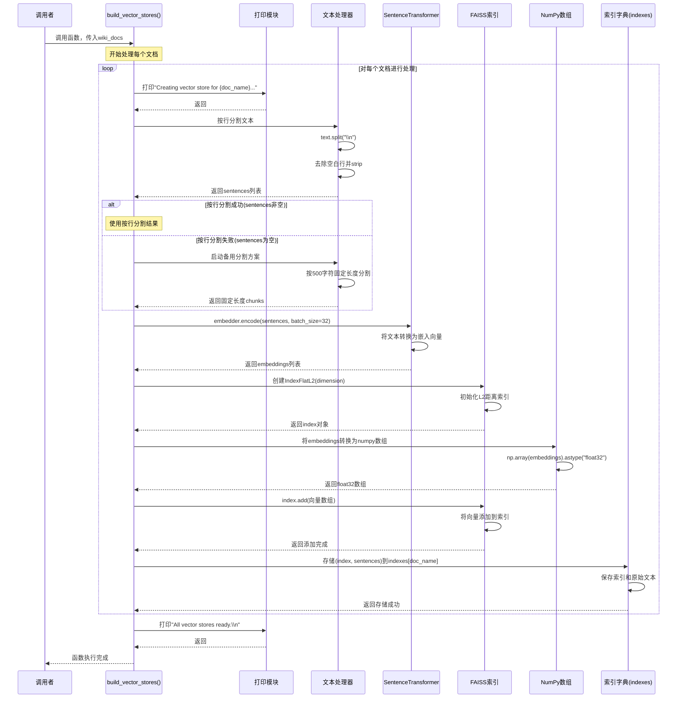
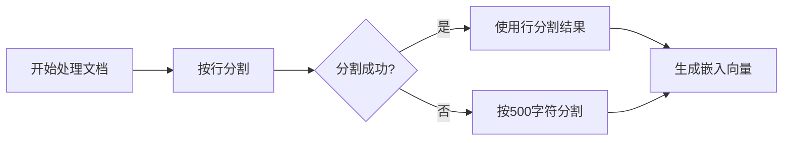

# 源代码逐步解释（中文版）

## 1. 函数定义
```python
def build_vector_stores(wiki_docs):
```
**功能**：定义名为`build_vector_stores`的函数，接收一个参数字典`wiki_docs`

## 2. 遍历文档字典
```python
for doc_name, text in wiki_docs.items():
```
**功能**：遍历输入的文档字典，每个文档包含：
- `doc_name`：文档名称（键）
- `text`：文档内容（值）

## 3. 显示处理进度
```python
print(f"Creating vector store for {doc_name}...")
```
**功能**：打印当前正在处理的文档名称，提供进度反馈

## 4. 按行分割文本（主要方法）
```python
sentences = [s.strip() for s in text.split("\n") if s.strip()]
```
**分步解析**：
1. `text.split("\n")`：将文本按换行符分割成多行
2. `for s in text.split("\n")`：遍历每一行
3. `s.strip()`：移除每行开头和结尾的空格/换行符
4. `if s.strip()`：过滤掉空行（只保留有内容的行）
5. `[...]`：列表推导式，生成处理后的句子列表

## 5. 备用分割方案（当按行分割失败时）
```python
if not sentences:
    sentences = [text[i:i+500] for i in range(0, len(text), 500)]
```
**逻辑分析**：
- `if not sentences:`：检查`sentences`列表是否为空
  - 为空的情况：原文为空 或 没有换行符
- 备用方案：将文本按500字符长度分割
  - `range(0, len(text), 500)`：生成从0到文本长度的步长为500的索引
  - `text[i:i+500]`：提取从索引`i`开始的500个字符
  - 效果：创建固定大小的文本块（可能切断完整句子）

## 6. 生成文本嵌入向量
```python
embeddings = embedder.encode(sentences, batch_size=32)
```
**功能**：
- 使用预训练的`embedder`模型
- 将每个`sentence`转换为向量表示（嵌入）
- `batch_size=32`：每次批量处理32个句子，提高效率

## 7. 创建FAISS向量索引
```python
index = faiss.IndexFlatL2(dimension)
```
**功能**：
- 创建FAISS的L2距离（欧氏距离）索引
- `dimension`：向量维度（由嵌入模型决定）
- 使用扁平索引结构，适合小到中等规模数据集

## 8. 添加向量到索引
```python
index.add(np.array(embeddings).astype("float32"))
```
**分步解析**：
1. `np.array(embeddings)`：将嵌入列表转换为NumPy数组
2. `.astype("float32")`：转换为32位浮点数（FAISS的要求）
3. `index.add(...)`：将所有向量添加到索引中

## 9. 存储索引和原文
```python
indexes[doc_name] = (index, sentences)
```
**功能**：
- 将FAISS索引和对应的原始句子保存到全局`indexes`字典
- 以`doc_name`为键，存储元组`(index, sentences)`
- 保留原文句子的原因：后续检索时能返回可读文本

## 10. 完成提示
```python
print("All vector stores ready.\n")
```
**功能**：所有文档处理完成后，打印完成信息

## 关键要点总结

### 1. 分割策略的优先级
```
主策略：按行分割 → 备用策略：固定长度分割
```
- 优先保留自然段落结构
- 防止空数据处理

### 2. 向量存储的组成
```
文档 → 分割 → 嵌入 → 索引 → 存储
```

### 3. 潜在问题
- 500字符的固定分割可能破坏句子完整性
- 没有考虑重叠窗口，可能导致上下文断裂
- 假设`embedder`、`dimension`、`indexes`已在外部定义

### 4. 适用场景
- 结构良好的文档（如维基百科，有明确换行）
- 中小规模文本集合
- 需要快速搭建原型系统的场景

这个函数的核心思想是：**将文档内容转化为可搜索的向量形式，保留原文结构的同时，建立高效的相似度检索能力**。

# Mermaid 序列图：build_vector_stores(wiki_docs) 函数执行流程



## 关键流程解释

### 1. **文档循环处理**


### 2. **分割策略决策流**
```
文本分割策略选择逻辑：
1. 优先尝试按行分割（保持自然结构）
2. 如果按行分割失败（没有换行符或空文本）
3. 回退到固定长度分割（500字符块）
```

### 3. **向量索引创建流程**
```
1. 文本 → 分割 → 句子列表
2. 句子列表 → SentenceTransformer → 向量嵌入
3. 向量嵌入 → NumPy数组 → FAISS索引
4. 索引+原文 → 存储到全局字典
```

## 时序说明

### 关键时序节点：
1. **初始化阶段**：创建FAISS索引（IndexFlatL2）
2. **数据处理阶段**：文本分割 → 向量化 → 添加到索引
3. **存储阶段**：索引和原文一并存储

### 性能考虑：
- **批量处理**：`batch_size=32` 提高嵌入计算效率
- **类型转换**：转换为`float32`减少内存占用
- **字典存储**：便于后续按文档名检索索引

## 数据流说明

```
数据流转：
wiki_docs (dict) 
    ↓
文档名和文本内容 (doc_name, text)
    ↓
分割后的句子列表 (sentences)
    ↓
嵌入向量矩阵 (embeddings)
    ↓
FAISS索引 (index)
    ↓
全局字典存储 (indexes[doc_name] = (index, sentences))
```

这个序列图清晰地展示了函数从接收输入到完成向量存储构建的完整过程，包括主要的分支逻辑和数据流转路径。

# FAISS 三大基础索引详解：IndexFlatL2、IndexIVFFlat、IndexIVFPQ

## 一、索引概览对比

| 索引类型 | 精度 | 速度 | 内存占用 | 适用场景 | 是否需要训练 |
|---------|------|------|---------|---------|------------|
| **IndexFlatL2** | 精确 | 慢 | 高 | 小数据集，精确检索 | 否 |
| **IndexIVFFlat** | 近似 | 快 | 中高 | 中等数据集，快速检索 | 是 |
| **IndexIVFPQ** | 近似 | 很快 | 低 | 大数据集，内存受限 | 是 |

## 二、详细解析

### 1. **IndexFlatL2**（扁平索引，L2距离）

#### 工作原理：
```python
# 本质是暴力搜索（Brute-force）
# 计算查询向量与所有向量的欧氏距离
for each query vector q:
    for each database vector v:
        distance = sqrt(sum((q_i - v_i)^2))  # L2距离
    sort distances and return top-k
```

#### 特点：
- **精确搜索**：返回100%准确的结果
- **无训练阶段**：可以直接添加向量
- **内存存储**：保存所有原始向量
- **复杂度**：O(N×d)，N是向量数，d是维度

#### 代码示例：
```python
import faiss
import numpy as np

# 创建索引
dimension = 768
index = faiss.IndexFlatL2(dimension)  # L2距离

# 添加数据
vectors = np.random.rand(1000, dimension).astype('float32')
index.add(vectors)  # 不需要训练

# 搜索
query = np.random.rand(1, dimension).astype('float32')
k = 5  # 返回5个最近邻
distances, indices = index.search(query, k)
```

#### 适用场景：
- 数据集 < 10,000 条向量
- 需要100%精确的结果
- 可作为其他索引的"量化器"（quantizer）

### 2. **IndexIVFFlat**（倒排文件 + 扁平索引）

#### 工作原理：
```
三阶段流程：
1. 训练阶段：用k-means将向量空间划分为nlist个簇
2. 索引阶段：每个向量分配到最近的簇，同一簇的向量存在一起
3. 搜索阶段：只搜索查询向量最近的nprobe个簇
```

#### 核心概念：
- **倒排文件（Inverted File）**：记录每个簇包含哪些向量
- **nlist**：聚类中心数量
- **nprobe**：搜索时探查的簇数量（平衡速度与精度）

#### 代码示例：
```python
import faiss

dimension = 768
nlist = 100  # 聚类中心数

# 1. 创建量化器（用于计算向量到哪个簇）
quantizer = faiss.IndexFlatL2(dimension)

# 2. 创建IVF索引
index = faiss.IndexIVFFlat(quantizer, dimension, nlist, faiss.METRIC_L2)

# 3. 训练（需要训练数据）
train_vectors = np.random.rand(10000, dimension).astype('float32')
index.train(train_vectors)

# 4. 添加数据
data_vectors = np.random.rand(100000, dimension).astype('float32')
index.add(data_vectors)

# 5. 设置搜索参数
index.nprobe = 10  # 搜索10个最近的簇

# 6. 搜索
query = np.random.rand(1, dimension).astype('float32')
distances, indices = index.search(query, k=5)
```

#### 参数调优：
```python
# nlist 选择经验公式：sqrt(N)
N = 1000000  # 数据量
optimal_nlist = int(np.sqrt(N))  # 约1000

# nprobe 对性能的影响：
nprobe = 1    # 最快，精度最低（只搜1个簇）
nprobe = nlist  # 最慢，精度最高（搜所有簇，退化为IndexFlatL2）
nprobe = 10~50  # 通常的平衡点
```

#### 适用场景：
- 数据集：10,000 ~ 1,000,000 条向量
- 需要快速近似搜索
- 内存充足（仍存储原始向量）

### 3. **IndexIVFPQ**（倒排文件 + 乘积量化）

#### 工作原理：
```
双重压缩：
1. IVF级别：向量空间划分为簇（同IVFFlat）
2. PQ级别：每个向量进一步被压缩：
   - 将768维向量切分成m段（如16段，每段48维）
   - 每段独立量化到2^bits个码字（如bits=8，256个码字）
   - 存储的是码字索引，不是原始向量
```

#### 核心概念：
- **乘积量化（Product Quantization）**：
  ```
  原始向量：[v1, v2, v3, ..., v768]
  分段：    段1(1-48维)  段2(49-96维) ... 段16(721-768维)
  量化：    码字索引1     码字索引2   ...  码字索引16
  
  存储：16个字节（每段1字节，如果bits=8）
  压缩率：768×4字节 → 16字节 = 192倍压缩
  ```

#### 代码示例：
```python
import faiss

dimension = 768
nlist = 100  # IVF聚类数
m = 16       # PQ分段数（必须能被dimension整除）
bits = 8     # 每段量化比特数（码字数=2^bits）

# 1. 创建量化器
quantizer = faiss.IndexFlatL2(dimension)

# 2. 创建IVFPQ索引
index = faiss.IndexIVFPQ(quantizer, dimension, nlist, m, bits)

# 3. 训练（需要更多训练数据）
train_vectors = np.random.rand(50000, dimension).astype('float32')
index.train(train_vectors)  # 训练IVF聚类和PQ码书

# 4. 添加数据
data_vectors = np.random.rand(1000000, dimension).astype('float32')
index.add(data_vectors)

# 5. 设置搜索参数
index.nprobe = 20

# 6. 搜索
query = np.random.rand(1, dimension).astype('float32')
distances, indices = index.search(query, k=5)
```

#### 参数选择策略：
```python
# m的选择（分段数）：
# 经验法则：dimension/m 应该是较小的整数（如8、16、32）
dimension = 768
possible_m = [96, 64, 48, 32, 24, 16, 12, 8]  # 768的约数

# bits的选择（每段比特数）：
# 通常使用8（256个码字），平衡精度和存储
bits = 8  # 码书大小=256，存储开销小
bits = 12 # 码书大小=4096，精度更高但需要更多训练数据
```

#### 距离计算优化：
```
PQ的距离计算是近似计算：
查询向量q → 与每个码字的距离表（查表法） → 快速计算近似距离

复杂度对比：
- 原始：O(N×d) = O(1M×768)
- PQ：O(N×m) = O(1M×16) + 查表开销
```

#### 适用场景：
- 大数据集：> 1,000,000 条向量
- 内存受限（向量被压缩存储）
- 接受一定的精度损失

## 三、性能对比实验

```python
import faiss
import numpy as np
import time

# 准备数据
dimension = 768
N = 100000  # 10万条数据
vectors = np.random.rand(N, dimension).astype('float32')
queries = np.random.rand(100, dimension).astype('float32')

# 1. IndexFlatL2
print("测试 IndexFlatL2...")
index_flat = faiss.IndexFlatL2(dimension)
index_flat.add(vectors)

start = time.time()
D_flat, I_flat = index_flat.search(queries, k=10)
flat_time = time.time() - start
print(f"时间: {flat_time:.2f}s, 内存: {vectors.nbytes/1024/1024:.0f}MB")

# 2. IndexIVFFlat
print("\n测试 IndexIVFFlat...")
nlist = 1000
quantizer = faiss.IndexFlatL2(dimension)
index_ivf = faiss.IndexIVFFlat(quantizer, dimension, nlist)
index_ivf.train(vectors)
index_ivf.add(vectors)
index_ivf.nprobe = 10

start = time.time()
D_ivf, I_ivf = index_ivf.search(queries, k=10)
ivf_time = time.time() - start
print(f"时间: {ivf_time:.2f}s, 加速比: {flat_time/ivf_time:.1f}x")

# 3. IndexIVFPQ
print("\n测试 IndexIVFPQ...")
m = 16
bits = 8
index_pq = faiss.IndexIVFPQ(quantizer, dimension, nlist, m, bits)
index_pq.train(vectors)
index_pq.add(vectors)
index_pq.nprobe = 10

start = time.time()
D_pq, I_pq = index_pq.search(queries, k=10)
pq_time = time.time() - start
print(f"时间: {pq_time:.2f}s, 内存压缩比: {vectors.nbytes/(N*m):.0f}x")
```

## 四、选择指南

### 决策流程图：
```
开始
↓
数据集大小？
├── < 10K → IndexFlatL2（精确搜索）
├── 10K-1M → IndexIVFFlat（快速近似）
└── > 1M → IndexIVFPQ（内存优化）
↓
是否需要更高精度？
├── 是 → 增加nprobe / 使用更大bits
└── 否 → 保持默认
↓
内存是否受限？
├── 是 → 使用IndexIVFPQ，调整m和bits
└── 否 → 使用IndexIVFFlat
```

### 实际应用建议：

1. **开发/测试阶段**：使用IndexFlatL2获取ground truth
2. **生产环境中等规模**：IndexIVFFlat，nprobe=10~50
3. **生产环境大规模**：IndexIVFPQ，m=16或32，bits=8
4. **混合策略**：使用IndexIVFFlat作为粗排，IndexFlatL2作为精排

## 五、高级技巧

### 1. 索引组合（复合索引）：
```python
# 使用Flat作为IVF的量化器（已常见）
# 还可以结合HNSW等图索引作为量化器
quantizer = faiss.IndexHNSWFlat(dimension, M=16)
index = faiss.IndexIVFFlat(quantizer, dimension, nlist)
```

### 2. GPU加速：
```python
# 将索引转移到GPU
res = faiss.StandardGpuResources()
gpu_index = faiss.index_cpu_to_gpu(res, 0, index)  # 使用GPU 0
```

### 3. 多索引合并：
```python
# 对超大数据集，可以分块构建索引
index1 = faiss.IndexIVFPQ(...)
index2 = faiss.IndexIVFPQ(...)

# 搜索时分别搜索再合并结果
```

## 六、总结

三种索引代表了FAISS的三个设计哲学：

1. **IndexFlatL2**：简单即美，精确为王
2. **IndexIVFFlat**：空间换时间，聚类加速
3. **IndexIVFPQ**：压缩存储，大规模可行

实际选择时需要权衡：
- **精度 vs 速度 vs 内存**
- **数据集大小**
- **硬件资源**
- **应用场景需求**

对于维基文档检索系统，如果文档数量在百万级以下，**IndexIVFFlat**通常是较好的平衡选择；如果超过百万级，则需要考虑**IndexIVFPQ**。