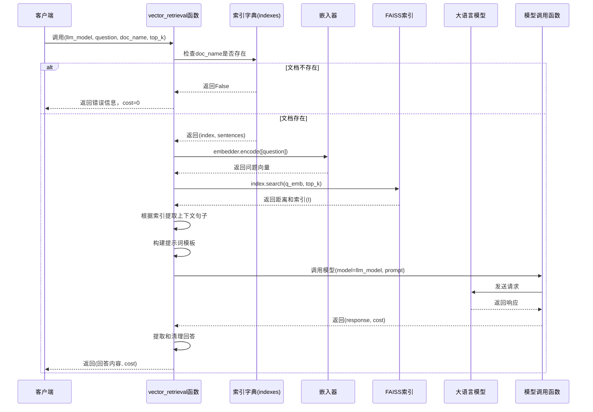
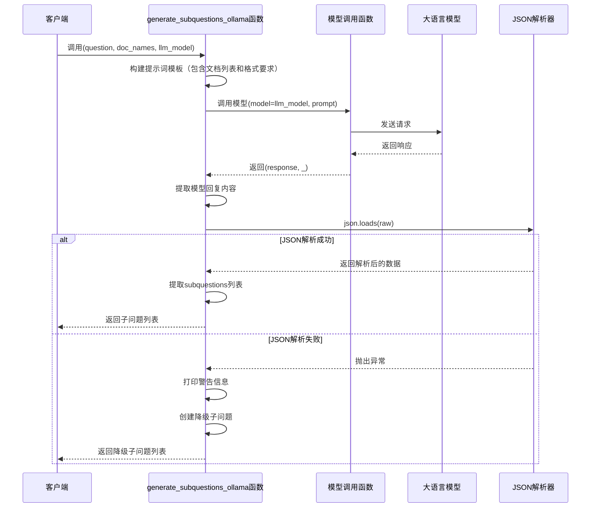
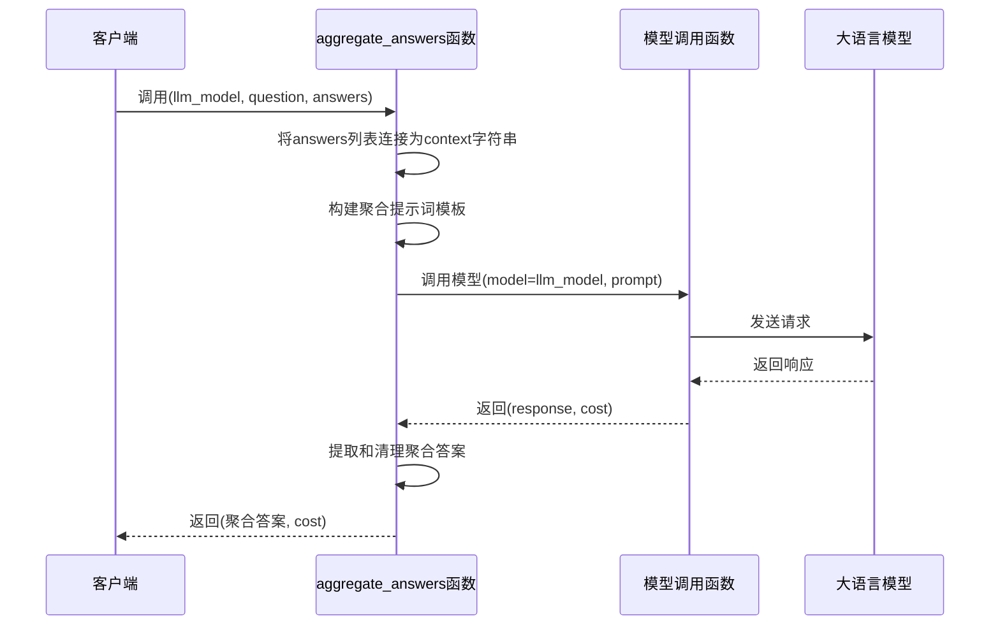
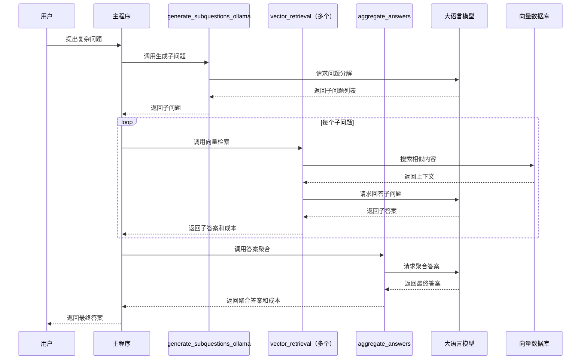

# Python 函数逐行详解（中文版）

## 1. **vector_retrieval 函数** - 向量检索

```python
def vector_retrieval(llm_model, question, doc_name, top_k=3):
    # 1. 检查请求的文档是否存在于索引中
    if doc_name not in indexes:
        # 2. 如果不存在，返回错误信息
        return f"No information for {doc_name}.", 0

    # 3. 从全局索引字典中获取该文档的FAISS索引和原始句子
    index, sentences = indexes[doc_name]
    
    # 4. 将问题编码为向量（转换为float32格式以满足FAISS要求）
    q_emb = embedder.encode([question]).astype("float32")
    
    # 5. 使用FAISS索引搜索最相似的top_k个向量
    #    _ 是距离数组，I 是索引数组
    _, I = index.search(q_emb, top_k)

    # 6. 根据检索到的索引，从原始句子中提取上下文
    #    I[0] 获取第一个查询的结果，if i >= 0 过滤无效索引（-1表示无结果）
    context = "\n".join([sentences[i] for i in I[0] if i >= 0])

    # 7. 构建提示词模板，明确要求模型仅使用提供的上下文回答问题
    prompt = f"""
You are a helpful assistant.
Answer the question using ONLY the context below.
If the answer is not present, say you don't know.

Question: {question}
Context:
{context}
Answer:
"""

    # 8. 调用大语言模型（LLM）获取回答和成本
    response, cost = llm_call(model=llm_model, user_prompt=prompt)
    
    # 9. 提取模型回复内容并去除首尾空白，与成本一起返回
    return response.choices[0].message.content.strip(), cost
```

### vector_retrieval 序列图



## 2. **generate_subquestions_ollama 函数** - 子问题生成

```python
def generate_subquestions_ollama(question, doc_names, llm_model):
    """
    Ollama-compatible subquestion generator.
    Returns list of {question, file_name, function}
    """
    # 1. 构建提示词，指导LLM分解问题
    prompt = f"""
You are an assistant that decomposes a question into subquestions.

Available documents:
{', '.join(doc_names)}  # 2. 列出可用文档名称

Rules:
- Use function "vector_retrieval" for fact questions  # 3. 指定使用vector_retrieval函数
- Each subquestion must reference ONE document  # 4. 每个子问题只针对一个文档
- Output MUST be valid JSON only  # 5. 要求输出必须是有效JSON

JSON format:  # 6. 定义JSON格式规范
{{
  "subquestions": [
    {{"question": "...", "file": "Toronto", "function": "vector_retrieval"}}
  ]
}}

User question: {question}  # 7. 要分解的原始问题
"""

    # 8. 调用LLM生成子问题
    response, _ = llm_call(model=llm_model, user_prompt=prompt)
    
    # 9. 提取模型回复内容并去除首尾空白
    raw = response.choices[0].message.content.strip()

    try:
        # 10. 尝试解析JSON格式的回复
        data = json.loads(raw)
        # 11. 返回子问题列表，如果不存在则返回空列表
        return data.get("subquestions", [])
    except Exception:
        # 12. JSON解析失败时的降级方案
        print("⚠️ Subquestion JSON parse failed. Using fallback.")
        # 13. 回退：将整个问题作为一个子问题，使用第一个文档
        return [
            {
                "question": question,
                "file": doc_names[0],  # 使用第一个文档名
                "function": "vector_retrieval",  # 默认使用向量检索函数
            }
        ]
```

### generate_subquestions_ollama 序列图



## 3. **aggregate_answers 函数** - 答案聚合

```python
def aggregate_answers(llm_model, question, answers):
    # 1. 将所有子问题的答案合并为一个上下文字符串
    context = "\n".join(answers)  # 使用换行符连接各个答案

    # 2. 构建聚合提示词，要求模型基于所有信息回答问题
    prompt = f"""
Use the following information to answer the question.
If unsure, say you don't know.

Question: {question}
Information:
{context}
Answer:
"""

    # 3. 调用LLM进行答案聚合
    response, cost = llm_call(model=llm_model, user_prompt=prompt)
    
    # 4. 提取聚合后的答案并去除首尾空白，与成本一起返回
    return response.choices[0].message.content.strip(), cost
```

### aggregate_answers 序列图



## 整体工作流程总结

这三个函数共同实现了一个**检索增强生成（RAG）系统**的工作流：

```
1. 问题分解阶段（generate_subquestions_ollama）:
   复杂问题 → 多个单文档子问题

2. 并行检索阶段（vector_retrieval × N）:
   每个子问题 → 向量检索 → 上下文获取 → LLM回答

3. 答案聚合阶段（aggregate_answers）:
   所有子答案 → 综合推理 → 最终答案
```

### 完整系统序列图



## 关键设计思想

1. **分而治之**：将复杂问题分解为针对单一文档的简单问题
2. **模块化设计**：每个函数职责单一，便于测试和维护
3. **容错处理**：JSON解析失败时提供降级方案
4. **成本跟踪**：每个LLM调用都返回成本信息
5. **上下文隔离**：确保每个检索操作只针对特定文档，避免信息污染